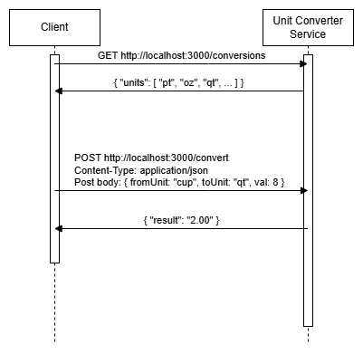

# Unit Converter
**A microservice for converting volumetric measurements.**

## Communication Contract
All example code seen here is in JavaScript. However, the implementation for other languages, like Python, would work more or less the same.
Also, the examples here assume that the service is running on localhost:3000. If the service was running somewhere else, the fetch requests
would have to be changed to use that URL instead.

### 1. Requesting Data
Using the fetch API for all examples:<br/>

**a. Send request to get all unit types**<br/>
```
const response = await fetch('http://localhost:3000/conversions')
```

**b. Send request to calculate a single conversion**<br/>
```
const request = {
    fromUnit: 'pt',
    toUnit: 'oz',
    val: 1
}

const response = await fetch('http://localhost:3000/convert', {
    method: 'post',
    body: JSON.stringify(request),
    headers: {
        'Content-Type': 'application/json'
    }
})
```

**c. Send request to calculate multiple conversions**<br/>
```
const request = {
    "conversions": [
        {
            "fromUnit": "oz",
            "toUnit": "cup",
            "val": 2.5
        },
        {
            "fromUnit": "pt",
            "toUnit": "qt",
            "val": 6
        },
        {
            "fromUnit": "qt",
            "toUnit": "cup",
            "val": 0.25
        }
    ]
}

const response = await fetch('http://localhost:3000/convert-multiple', {
    method: 'post',
    body: JSON.stringify(request),
    headers: {
        'Content-Type': 'application/json'
    }
})
```

### 2. Receiving Data
Using the fetch API for all examples. Request portions of the code are also shown for context.<br/>

**a. Getting unit types**<br/>
Here is example code which calls the API to get all unit types.<br/>
```
const response = await fetch('http://localhost:3000/conversions')
const data = await response.json()
```
After this code runs, 'data' will contain the object:<br/>
{<br/>
&nbsp;&nbsp;&nbsp;&nbsp;"units": ["pt", "oz", "qt", "cup", "L", "mL", "tsp", "Tbsp"]<br/>
}<br/>

**b. Calculating one unit conversion**<br/>
Here is example code for calling the API to convert 1 pint to ounces:<br/>
```
let data

const request = {
    fromUnit: 'pt',
    toUnit: 'oz',
    val: 1
}

const response = await fetch('http://localhost:3000/convert', {
    method: 'post',
    body: JSON.stringify(request),
    headers: {
        'Content-Type': 'application/json'
    }
})

if (response.status === 400) {
    console.log("Bad request: make sure the unit types are in the list of valid unit types and that the value is numeric.")
} else {
    data = await response.json()
}
```
After this code runs, 'data' will contain the object:<br/>
{<br/>
&nbsp;&nbsp;&nbsp;&nbsp;"result": "16.00"<br/>
}<br/>

**c. Calculating multiple unit conversions in one request**<br/>
Here is example code for calling the API to perform 2 conversions; one to convert 4 cups to a quart, and another to convert 1000 mL to a liter.<br/>
```
let data

const request = {
    conversions: [
        {
            fromUnit: "cup",
            toUnit: "qt",
            "val": 4
        },
        {
            fromUnit: "mL",
            toUnit: "L",
            val: 1000
        }
    ]
}

const response = await fetch('http://localhost:3000/convert', {
    method: 'post',
    body: JSON.stringify(request),
    headers: {
        'Content-Type': 'application/json'
    }
})

if (response.status === 400) {
    console.log("Bad request: make sure the unit types are in the list of valid unit types and that the value is numeric.")
} else {
    data = await response.json()
}
```
After this code runs, 'data' will contain the object:<br/>
{<br/>
&nbsp;&nbsp;&nbsp;&nbsp;"result": ["1", "1"]<br/>
}<br/>

### 3. UML Diagram
